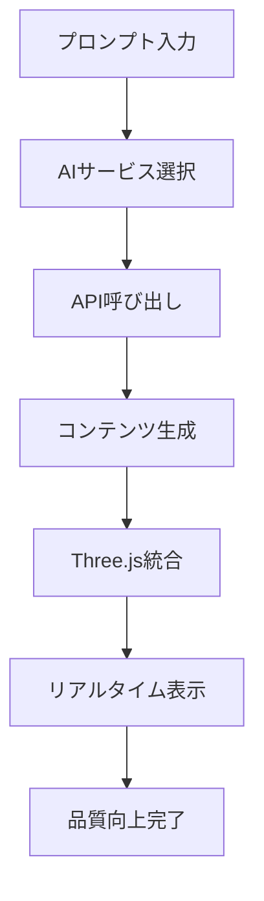

# 🌟 FanVerse - インフルエンサー向けパーソナルバーチャル空間プラットフォーム

## 📖 プロジェクト概要

FanVerseは、インフルエンサーが自身のブランドや世界観を反映したオリジナルのバーチャル空間を簡単に構築・運営し、ファンとの新しい形のエンゲージメントを創出し、自然な形で収益化も実現できるプラットフォームです。

### 🎯 コアコンセプト
「バーチャル空間の一等地を、インフルエンサー自身の手で創造できる」体験の提供

### 👥 ターゲットユーザー
- **インフルエンサー**: ペット、VTuber、美容、ゲーム実況、教育など幅広いジャンル
- **ファン**: 応援するインフルエンサーの世界観に浸りたい人々

## 🤖 AI統合機能 (NEW!)

### 対応AIサービス

1. **OpenAI DALL-E 3** - 高品質テクスチャ生成
   - コスト: $0.040/画像
   - 用途: 家具・材質のリアルなテクスチャ

2. **Stability AI** - PBRマテリアル生成  
   - コスト: $0.02/画像
   - 用途: シームレステクスチャ、法線マップ

3. **Meshy AI** - 3Dモデル生成
   - コスト: $0.20/モデル
   - 用途: テキストから3Dオブジェクト生成

4. **Kaedim3D** - 画像から3D変換
   - コスト: $1.00/モデル
   - 用途: 写真・イラストから3Dモデル化

### 🔧 AI機能セットアップ

#### 1. APIキー取得

**OpenAI DALL-E 3:**
```bash
# https://platform.openai.com/api-keys でAPIキー取得
# 月額制限: $20/月（個人利用）
```

**Stability AI:**
```bash
# https://platform.stability.ai/ でAPIキー取得
# クレジット制: $10で1000画像
```

**Meshy AI:**
```bash
# https://meshy.ai/ でAPIキー取得
# 無料プラン: 月20回まで
```

**Kaedim3D:**
```bash
# https://www.kaedim3d.com/ でAPIキー取得
# プロプラン: $50/月
```

#### 2. バックエンドセットアップ

```bash
cd backend
npm install node-fetch @types/node-fetch
npm run dev
```

#### 3. フロントエンドでのAI利用

1. http://localhost:5174/test にアクセス
2. 「🤖 AI強化」モードを選択
3. 右パネルでAPIキーを設定
4. プロンプトを入力して生成開始

### 💡 効果的なプロンプト例

**テクスチャ生成:**
```
"high-quality brown leather texture with natural grain patterns, realistic scratches and wear, photorealistic material for luxury furniture, 4K seamless texture"
```

**3Dモデル生成:**
```
"modern minimalist chair with wooden legs and fabric cushion, clean lines, scandinavian design, web-optimized 3D model"
```

### 🚀 AI統合のワークフロー



### 📊 コスト最適化

- **開発段階**: Stability AI推奨（低コスト）
- **プロダクション**: DALL-E 3推奨（高品質）
- **3Dモデル**: Meshy AI（バランス良好）

### 🛡️ セキュリティ

- APIキーはローカルストレージに保存
- プロダクション環境では環境変数使用推奨
- レート制限とエラーハンドリング実装済み

## 🛠️ 技術スタック

### フロントエンド
- **React** + **TypeScript** + **Vite**
- **Three.js** (3D描画エンジン)
- **Tailwind CSS** (スタイリング)
- **Zustand** (状態管理)
- **React Router** (ルーティング)

### バックエンド
- **Node.js** + **Express** + **TypeScript**
- **SQLite** (データベース)
- **JWT** (認証)
- **Multer** (ファイルアップロード)

## 🚀 セットアップと起動

### 前提条件
- Node.js 18.x 以上
- npm または yarn

### インストール

```bash
# リポジトリをクローン
git clone <repository-url>
cd my-virtual-space-project

# フロントエンドの依存関係をインストール
cd frontend
npm install

# バックエンドの依存関係をインストール
cd ../backend
npm install
```

### 開発サーバーの起動

```bash
# バックエンドサーバーを起動 (別のターミナル)
cd backend
npm run dev

# フロントエンドサーバーを起動 (別のターミナル)
cd frontend
npm run dev
```

## 📁 プロジェクト構造

```
my-virtual-space-project/
├── frontend/                 # フロントエンドアプリケーション
│   ├── src/
│   │   ├── components/       # Reactコンポーネント
│   │   ├── pages/           # ページコンポーネント
│   │   ├── hooks/           # カスタムフック
│   │   ├── stores/          # Zustand状態管理
│   │   ├── utils/           # ユーティリティ関数
│   │   └── types/           # TypeScript型定義
│   └── public/              # 静的ファイル
├── backend/                 # バックエンドAPI
│   └── src/
│       ├── controllers/     # APIコントローラー
│       ├── models/          # データモデル
│       ├── routes/          # ルート定義
│       ├── middleware/      # ミドルウェア
│       ├── utils/           # ユーティリティ関数
│       └── types/           # TypeScript型定義
└── README.md
```

## ✨ MVP機能一覧

### インフルエンサー向け機能
- [x] アカウント作成・ログイン
- [x] バーチャル空間の作成・編集
- [x] 空間テンプレートの選択
- [x] 基本的なカスタマイズ機能
- [x] コンテンツ表示機能
- [x] シンプルな収益化機能

### ファン向け機能
- [x] 空間へのアクセス
- [x] アバター表示と移動
- [x] テキストチャット
- [x] リアクション機能
- [x] 応援機能

## 🔒 セキュリティ

- JWT認証によるセキュアなログイン
- レート制限による不正アクセス防止
- ヘルメットによるセキュリティヘッダー設定
- ファイルアップロードの検証

## 📞 サポート

質問や問題がございましたら、Issueを作成してください。

## 📄 ライセンス

MIT License

---

**FanVerse** - インフルエンサーとファンをつなぐ新しいバーチャル体験 

## 🛠️ AI API セットアップガイド

### 📋 必要なAPIキー

1. **OpenAI DALL-E 3** - テクスチャ生成
   - サイト: https://platform.openai.com/api-keys
   - 形式: `sk-proj-...` または `sk-...`
   - コスト: $0.040/画像 (standard), $0.080/画像 (hd)

2. **Stability AI** - 追加テクスチャオプション
   - サイト: https://platform.stability.ai/
   - 形式: `sk-...`
   - コスト: $0.02/画像

3. **Meshy AI** - 3Dモデル生成
   - サイト: https://meshy.ai/
   - 形式: `msy_...`
   - コスト: $0.20/モデル

### 🔧 セットアップ手順

1. **APIキー取得**
   ```bash
   # OpenAI APIキーを取得
   # 1. https://platform.openai.com/api-keys にアクセス
   # 2. "Create new secret key" をクリック
   # 3. キーをコピー（sk-proj- または sk- で始まる）
   ```

2. **環境変数設定**
   ```bash
   cd backend
   cp .env.example .env
   
   # .envファイルを編集
   OPENAI_API_KEY=sk-proj-あなたの実際のAPIキー
   STABILITY_API_KEY=sk-あなたのStabilityAIキー
   MESHY_API_KEY=msy_あなたのMeshyAIキー
   ```

3. **バックエンド再起動**
   ```bash
   cd backend
   npm run dev
   ```

4. **動作確認**
   ```bash
   # APIキー状態確認
   curl http://localhost:3001/api/ai/api-keys/status
   
   # テクスチャ生成テスト
  curl -X POST http://localhost:3001/api/ai/generate-texture \
    -H "Content-Type: application/json" \
    -d '{"prompt": "brick wall texture"}'
  ```

`/generate-texture` は旧エンドポイント `/generate-wall-floor` のエイリアスです。

### ⚠️ 現在のエラー解決方法

もし以下のエラーが出る場合：
```
❌ DALL-E 3 API Error: { error: { type: 'image_generation_user_error' } }
```

**解決策:**
1. **APIキーの確認**: `sk-proj-` または `sk-` で始まる完全なキーを使用
2. **課金設定**: OpenAIアカウントで支払い方法が設定されているか確認
3. **利用制限**: アカウントのクォータを確認（https://platform.openai.com/usage）
4. **キーの権限**: APIキーがDALL-E 3へのアクセス権限を持っているか確認

### 🎭 デモモード

APIキーが正しく設定されていない場合、システムは自動的にデモモードで動作し、高品質なサンプルテクスチャを使用します。

### 💡 コスト最適化のヒント

- **開発段階**: デモモード（無料）
- **テスト段階**: DALL-E 3 standard品質（$0.040/画像）
- **本番環境**: DALL-E 3 hd品質（$0.080/画像）

## 🚀 セットアップと起動 